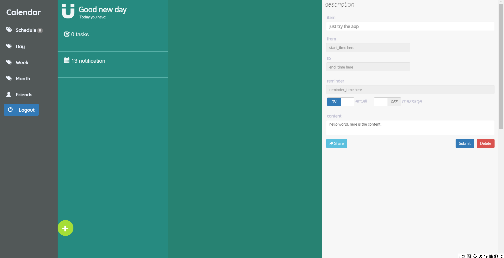

# wiki

## 视图

- 页面具有schedule, day, week, month 4种视图

## 页面布局

### 概述

- schedule视图中，共有sidebar, index, list, desc 4个部分


### 响应式

- schedule视图

  - 桌面：全部显示

    

  - 平板：显示 index, list，剩下sidebar, desc通过点击唤出

  - 手机：仅显示index，其余部分通过点击唤出

- calendar视图

  - calendar视图共有3个子视图：month, agendaWeek, agendaDay
  - 视图上方header部分布局
    - pc尺寸：向左，向右，today（这3个用于跳转日期），以及title部分用于显示当前日期时段（e.g.月份，周数）
    - 手机/平板尺寸：向左，向右（用于跳转日期），sidebar按钮（用于唤出sidebar），title（同pc尺寸下，用于显示当前时段，**点击时效果同pc尺寸下today按钮**）


## 使用插件

- [jquery-labelauty](https://github.com/fntneves/jquery-labelauty)
  - 用于修改desc部分复选框样式
  - 所有样式定义在`jquery-labelauty.css `文件里，可以自行修改


## 页面细节

1. 添加的元素在层叠属性上(`z-index`)从100开始，具体设置如下：
   - mask：110


## 前端日程显示

1. 仅显示当天开始的日程以及以前没有完成的日程
2. finish状态：
   - 设置'finish'按钮，确认完成，点击保存，更改数据库信息，然后为该条目添加taskfinished类样式


## 前后端数据格式规定

- 时间：
  - 由于插件`mobiscroll`产生的日期格式非标砖ISO 8601格式，e.g.: '2018-04-08 21:00'，所以采用以下方式传递时间信息并存储
  - 前端->后端：直接传递插件生成的字符串，后端解析成datetime对象后存入数据库(通过`datetime.datetime.strptime`方法)
  - 后端->前端：由datetime生成ISO 8601格式字符串，放入fullcalendar插件指定格式的JSON中
    - calendar部分：可以通过正则格式化成可阅读形式(函数`iso2timeStr`)
    - schedule部分：通过JS，先转date对象，后提取数字，插入`desc`部分input标签中


时间转换参考教程：

- [python的datetime，date，时间戳，string的转换](https://www.jianshu.com/p/a4b1f0f9ffbe)
- [ISO Time (ISO 8601) in Python?](https://stackoverflow.com/questions/2150739/iso-time-iso-8601-in-python)

其他：

- [JQuery 判断checkbox是否选中，checkbox全选，获取checkbox选中值](https://my.oschina.net/u/2548093/blog/549463)
  - **修改checkbox状态应使用`prop`，e.g. `$element.prop('checked', true)`**


## 前端数据操作

### list渲染

- 主要调用函数：`render_list()`

- 功能：向后端查询最新日程情况，用于更新list部分

- 实现原理：

  1. 清空list ul部分

  2. 加入list中close按钮

  3. 调用`AjaxGetTasks()`，并将`render_listItems(tasks)`作为回掉函数传入。当请求完成后，遍历存放task的数组，渲染日程item。

     > 注意：实际执行渲染任务的函数一定要作为回掉传入异步AJAX，只有确认数据接收完成，才能开始render.

  4. 渲染task item时，将日程具体内容通过`data-[index_name]`的方式存入`<li>`元素中

- 调用情况：

  1. `initSchedule()`，初始化schedule视图时渲染list
  2. `AjaxAddTask()`，完成新建日程后渲染list

### desc/modal填充 

- 主要调用函数：`render_desc()`

- 点击list部分日程item后，将日程信息填充到desc/modal部分中，以备后期修改或删除

- 实现原理：
  1. 判断如果是list部分的close按钮，就不渲染这条
  2. 通过`$(this)`从点击的list item条目中取得存入的task信息，判断设备是否为'pc'，决定渲染路径
     - pc -> desc
     - 手机/平板 -> modal
  3. 注意要把task id绑定到submit按钮上，同时向其添加属性`data-type="modify"`

- 调用情况：
  1. 通过`bind_render_desc()`绑定到task item上，点击即渲染对应信息

     > 在`AjaxGetTask()`的回掉函数`render_listItems(tasks)`完成对所有日程条目渲染后，绑定点击事件，防止DOM改变后事件失效

### 新建/修改日程

- 主要调用函数：`AjaxAddTask()`

- 实现原理：

  1. 从表单中提取信息，获取日程必要信息

  2. 查看submit按钮上是否绑定属性`data-type="modify"`，如果有，则为修改日程；否则为创建日程

  3. 对应url：

     - 新建task url: `/newtask/`
     - 修改task url: `/modtask/`

  4. 提交的信息如下：

     ```json
     'title': title,
     'content': content,
     'all_day': all_day,
     'start': start,
     'end': end,
     'email_remind': email_remind,
     'message_remind': message_remind,
     'remindtime': remindtime,
     'status': status,
     'task_id': task_id
     ```

     注意：`task_id`为修改日程时才加上去的，如果当前为创建日程，值为空字符串，虽然也提交但后端不会验证/接收

  5. 在后端新建/修改日程完成后，异步结束 ，前端重新渲染list，desc部分不变，用于显示创建/修改的内容

     > 不用担心状态污染，下次查看日程会将desc中所有绑定信息覆盖，下次创建日程会调用`clearForm()`把desc所有状态清空

- 调用情况：

  1. 将`AjaxAddTask()`绑定到submit按钮上，点击即提交信息，后重新渲染页面

### 删除日程

- 主要调用函数：`AjaxDeleteTask()`

- 主要实现原理：

  1. 通过查看submit按钮上`data-id`属性是否为空，判断时查看日程还是正在新建

     - 如果是正在新建，点击delete按钮，直接清空表单即可（调用`cleanForm()`函数）
     - 如果是查看日程，点击delete按钮，提取`data-id`值，作为放入`task_id`字段，通过AJAX方法{POST}传给删除接口，异步完成后，清空表单，重新渲染list。

  2. 提交信息实例如下：

     ```json
     'task_id': task_id
     ```

- 调用情况

  1. 将`AjaxDeleteTask()`绑定到delete按钮上，点击即删除信息

- 注意：后期在app中，可以需要通过prompt提示框和语音识别服务传递信息，所以此处删除前暂不做提示框弹出，要求用户确认


## 本次修改

1. fix[front]: fix bug that can't close list part with list-close button after adding or deleting task